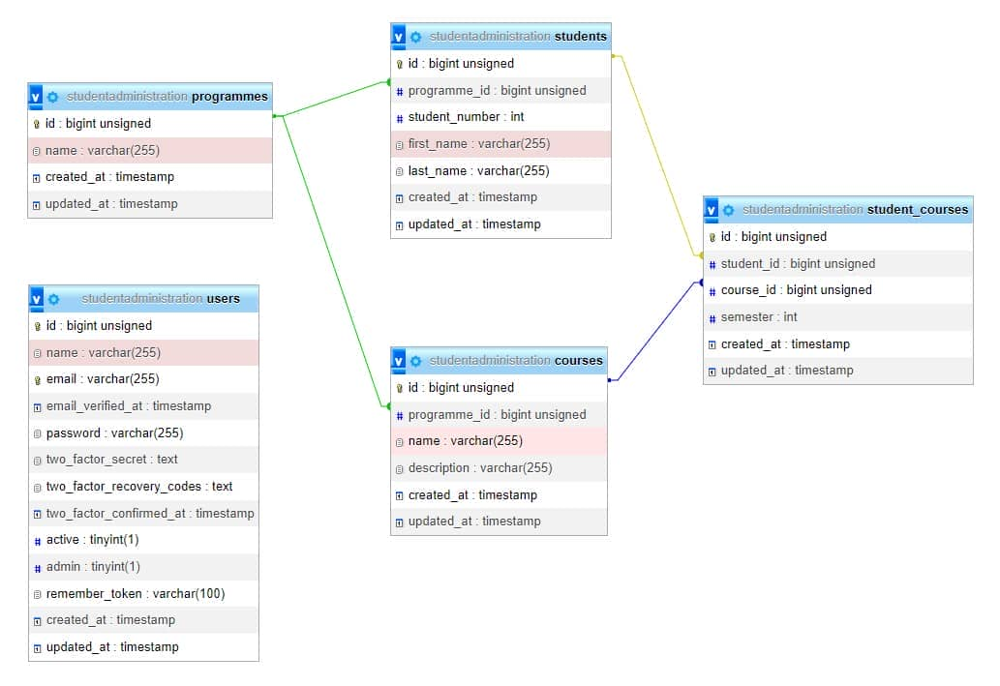

# Student Administration Application
For extra info, check the exercise website: https://itf-laravel-10.netlify.app/exercise/

## Overview/end result
> https://itf-laravel-10.netlify.app/exercise/#overview-end-result

- A dashboard with all courses
    - Filter on name, description and programme
- Authentication
  - Authenticated user without admin rights
    - Can view students enrolled in course
- Admin user
  - Can create, read, update and delete Thomas More programmes
  - Can add courses to a programme

---

## Part 1 - Creating the project
> https://itf-laravel-10.netlify.app/exercise/part1#part-1-creating-the-project

- Make a new Laravel 10 project student_administration
- Configure Homestead
  - Update C:\vagrant\homestead\Homestead.yaml
- <a href="https://itf-laravel-10.netlify.app/config/laravel.html#configure-phpstorm" target="_blank">Configure PhpStorm</a>
  - Laravel Idea plugin
  - (source) directories

---

## Part 2 - Creating a route and view
> https://itf-laravel-10.netlify.app/exercise/part2#part-2-creating-a-route-and-view

- Create a route and view for the home page (= page shown at root URL)
- For now the homepage only shows a `h1` title:

Screenshots: see exercise website...

---

## Part 3 - Layout Component
> https://itf-laravel-10.netlify.app/exercise/part3#part-3-layout-compontent

- Create a layout component for the application
    - Include Tailwind and Alpine JS scripts
    - There are 3 slots
      - title: title in browser tab and h1 on page (1)
      - description: meta description tag
      - slot: main content of the page (2)
    - There are 2 child components
      - Navigation (3)
      - Footer (4)

Screenshots: see exercise website...

---

## Part 4 - Automation
> https://itf-laravel-10.netlify.app/exercise/part4#part-4-automation

- Install and configure Laravel Vite
  - Optional: Auto run Vite
- Update Layout Component
  - Remove CDN links
  - Add the vite reference to the CSS and JS file
- Result:
  - Your automated work flow can be started by the command `npm run dev`
    - Optional: Automated work flow starts when you open the project
- Your application is available at http://student_administration.test/ and is refreshed automatically

Screenshots: see exercise website...

---

## Part 5 - Components
> https://itf-laravel-10.netlify.app/exercise/part5#part-5-components

- Set up the <a href="https://itf-laravel-10.netlify.app/laravel/components.html" target="_blank">reusable components</a> from the course in the Student Administration project
- Show the Tailwind breakpoint in the footer, but only for local development
- Make a link to an empty courses page
  - Make sure the current page is clearly visible in the menu
  - Try out different Tailwind classes to customize the active/hover/focus state!

Screenshots: see exercise website...

---

## Part 6 - Database
> https://itf-laravel-10.netlify.app/exercise/part6#part-6-database

- Create the correct migrations and Eloquent models for the following database schema
- Add relationships between the Eloquent models

> ### Remarks
>
> - The many side of the relationship always holds the foreign key
>  - A programme can have multiple students subscribed -> `programme_id` is defined in students table
> - A student can enroll in multiple courses AND a course can be followed by multiple students. This is a many-to-many relationship which we have to implement by using an associative table student_courses.
>  - If you use the command `php artisan make:model StudentCourse -m`, the corresponding database table will be named student_courses. According to the naming conventions, we also advice to use `studentcourses()` as the associated Eloquent hasMany relationship method.

- Add some <a href="https://gist.github.com/mcloots/3c7efe6804f6aa600428bbb98cecec5b" target="_blank">test data</a> to these tables

---

## Part 7 - Courses dashboard
> https://itf-laravel-10.netlify.app/exercise/part7#part-7-courses-dashboard

- Configure <a href="https://itf-laravel-10.netlify.app/config/debug.html" target="_blank">Debug Livewire</a>
- New Livewire component for courses: CoursesOverview
  - Custom pagination
  - Preloader
- Show a dashboard of courses, sorted alphabetically
  - Use Tailwind to design a minimalistic card per course
  - Card should include:
    - Programme name
    - Course name
    - Course description
    - Button to manage students
- Show a form for filtering (the functionality will be added in <a href="https://itf-laravel-10.netlify.app/exercise/part8.html" target="_blank">part 8</a>)
  - One text input
  - One dropdown list with all the programmes
  - One dropdown list with the amount of records per page

- Detail modal for the selected course
  - Name of course
  - Description of course
  - List of students enrolled in course
    - Semester 1/2 in parentheses

- Disable buttons for courses which don't have any students

Screenshots: see exercise website...

---

## Part 8 - Course filter
> https://itf-laravel-10.netlify.app/exercise/part8#part-8-course-filter

- Form for filtering
  - Filter on course name or description
  - Choose a programme in the dropdown list
  - The form submits when
    - The user changes the text input (course name or description)
    - The user changes the dropdown value (programme or amount of records)
      - Think about debouncing!

- Custom error message when filter doesn't return a result

Screenshots: see exercise website...

---

## Part 9 - Authentication
> https://itf-laravel-10.netlify.app/exercise/part9#part-9-authentication 

- Update navigation component
  - Links to register and login pages
  - Dropdown with
    - Initials of logged-in user
    - Name of logged-in user
    - Link to dashboard
    - Update profile
    - Logout
- Use studentadministration layout on
  - Authentication pages
  - Dashboard page
  - Profile page

- Update logo on authentication pages to Thomas More logo

- Protect routes to dashboard and profile so only authenticated users can visit them
  - Redirect others to the login page
  - Make sure they are invisible in the navigation

- Make admin middleware, to be used later
- Make sure only active users have access to the authentication pages

Screenshots: see exercise website...

---
## Part 10 - Permissions, Error pages & Profile
> https://itf-laravel-10.netlify.app/exercise/part10#part-10-permissions-error-pages-profile

### Permissions
#### Non-authenticated users (guests)

- Guests (e.g. students interested in some courses) can only access the home page and the courses dashboard (but the buttons 'Manage students' are not visible in the course cards)

#### Authenticated users without admin rights

- Authenticated users without admin rights (e.g. lecturers interested in a list of students enrolled for their course) can access the home page, the courses dashboard (with 'Manage students' buttons) and the course detail pages

> ### Remark
> In order to be able to test this behaviour, you should add a user/lecturer (e.g. Peter Peters) without admin rights to your database

#### Authenticated users with admin rights

- Authenticated users with admin rights (e.g. programme heads, secretaries or lecturers who manage the student programmes) obviously can access all the pages that are accessible by a user without admin rights as well
- On top of these functionalities, they will be able to perform some administrative tasks
  - For one of these tasks, i.e. creating, updating and deleting programmes, you should add a Programmes link to the navbar. The link should only be visible to authenticated users. The programming logic behind this additional functionality is tackled in the next part of this exercise.

### Error pages

- Make sure all error pages use the Student Administration layout component
  - Error pages 401, 403, 419, 429, 500 and 503
  - Error page 404
    - Make sure login and register links don't show

### Profile

- Make sure your name changes immediately in the navbar when you change it using "Update profile"
- Enable the use of profile pictures and show them in the navbar

Screenshots: see exercise website...

---

## Part 11 - CRUD Programmes
> https://itf-laravel-10.netlify.app/exercise/part11#part-11-crud-programmes

- In this part you have to build a fully operational CRUD for the programmes
- Every route corresponding to this programmes CRUD is only accessible if you are logged in AND you have admin rights.

> Use the admin middleware you made earlier to protect these routes from unauthorized access.

### Final details

- Make the programme name clickable
- Add a spinner to the update input fields
- Don't update the programme when the name has not changed
- Add pagination to the table

Screenshots: see exercise website...

---

## Part 12 - Add courses to programme
>https://itf-laravel-10.netlify.app/exercise/part12#part-12-add-courses-to-programme

- When we navigate to the detail page of a programme we want to be able to add new courses to this programme
- Add a new action button with the icon of a book
- When you click on the book:
  - A modal opens
  - All the existing courses of the programme are shown
    - When you hover over a course name, the course description is shown
  - The modal shows a form to add a new course
      - The form should have an input for the name and a textarea for the description

- When you add a course:
    - A confirmation message is shown
    - The name and description inputs are cleared
    - The courses list is updated without refreshing or closing the modal

Screenshots: see exercise website...

### The End
- If you did all the previous steps, you successfully finished the Student Administration application. Congratulations!
- Tip for studying: Look at the parts of the project we did together one more time. Or even better, change some things on your own. See if you can make the project do new things.
- Want to get really good at PHP? Here's an idea: try adding something new to the project. It could be a small part, like a new feature, or something bigger. This is a good way to make sure you understand PHP well and will be a great advantage for you on the exam and in the project of the second semester.
